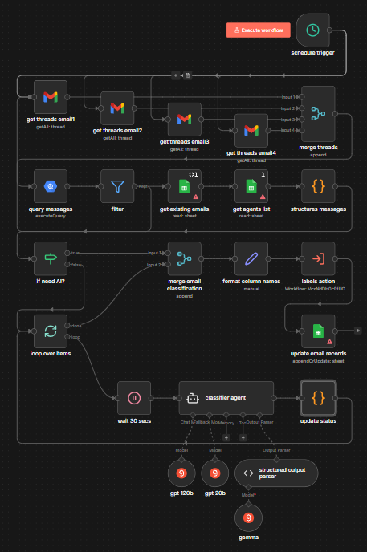

# Automated Email Lead Classifier

## Project Overview:

This n8n workflow serves as an intelligent bridge between raw email communication and structured lead management. By combining automated retrieval, internal data mapping, and LLM-powered classification, the system identifies high-value opportunities and organizes them into a CRM-ready format.

## The Workflow Logic

The automation follows a structured four-phase pipeline to move from raw inbox data to actionable lead intelligence:

**1. Data Aggregation & Synthesis**

- The workflow begins by polling multiple email sources to capture a comprehensive view of ongoing conversations.
- Collection: It gathers threads from various accounts and merges them into a single stream.
- Contextual Querying: Individual messages are queried and filtered to ensure only relevant, recent exchanges are processed.
- Synchronization: The system cross-references this with existing internal records and a master list of agents to ensure every lead is correctly attributed to a staff member.

**2. Intelligent Message Structuring**

- Raw email text is often noisy. Before classification, the data is passed through a "Structure Messages" code block.
- This logic strips away signatures and reply headers to isolate the core conversation.
- It groups messages into threads to provide the AI with the full context of the dialogue.

**3. AI-Driven Classification**

- Once the conversation is cleaned, it enters a conditional loop. If a thread requires evaluation, it is sent to the Classifier Agent.
- Model Orchestration: The system utilizes a multi-model approach (GPT-120b and GPT-20b) to analyze the sentiment and intent of the lead.
- Categorization: Leads are sorted into predefined buckets like "HOT_LEAD" or "POTENTIAL_LEAD" based on specific business rules.
- Structured Output: A dedicated parser ensures the AI's reasoning is translated into valid JSON for the next step.

**4. Record Finalization & Labeling**

- The final phase translates AI insights into database actions.
- Dynamic Labeling: The workflow maps the AI's decision to specific internal label IDs unique to each agent.
- CRM Update: Finally, it updates the master records (via Google Sheets) with the new status, follow-up dates, and truncated message history.

## Technical Node Stack

The following nodes are utilized to execute this workflow:

- **Schedule Trigger**: Drives the automated polling interval
- **Gmail Nodes**: Multi-account retrieval of email threads
- **Filter & If**: Determines if a thread requires AI intervention
- **Structures Messages**: Custom JS for reply-stripping and history management.
- **Google Sheets**: Source of truth for existing records and agent IDs.
- **Classifier Agent**: LLM-based sentiment and intent analyzer
- **Edit Node**: Maps AI text output to structured database labels.

## Business Impact

**Scalability**: Allows a single agent to manage hundreds of threads by only focusing on "HOT" or "POTENTIAL" leads flagged by the AI.
**Data Integrity**: Automatically cleans and truncates message history (keeping only the last 3 exchanges) to keep the database lean and relevant.
**Persistence**: Automatically calculates and schedules follow-up dates to ensure no lead goes cold.
