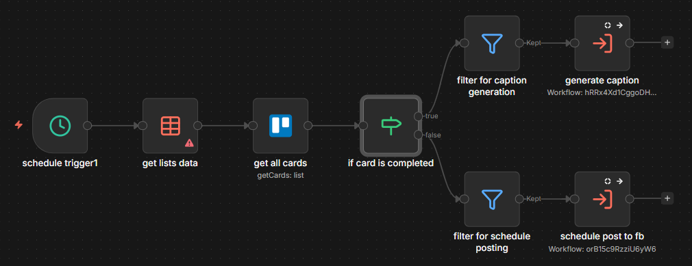

# Automated Facebook Task Delegation

## The Workflow Logic

**1. Scheduling & Data Acquisition**

- This phase initiates the automation and gathers the raw data needed for processing.
- The schedule trigger1 node runs on a defined cron schedule (e.g., business hours on weekdays). This ensures content is processed only when the team is available to monitor it.
- The get lists data node identifies the specific Trello list to monitor. Subsequently, the get all cards node pulls comprehensive details for every card in that list, including descriptions, labels, and due dates.

**2. Status Routing (The "Traffic Controller")**

- This phase determines the lifecycle stage of each card to decide the next action.
- The if card is completed node splits the workflow into two distinct paths based on the dueComplete status.
  - **False Routes** to the caption generation pipeline (Work in Progress).
  - **True Path**: Routes to the publishing pipeline (Ready for Release). 3.

**3. Caption Generation Pipeline**

- This path handles cards that are still in the drafting or creation phase.
- The filter for caption generation node applies strict logic to ensure only valid candidates are processed: it checks that the card is not completed, the description is empty (indicating missing copy), and it hasn't already been labeled as 'SCHEDULED'.
- The generate caption node triggers a separate, specialized workflow. This modular approach offloads the complex AI processing, keeping the main logic clean.

**4. Publishing Pipeline**

- This path handles cards that are ready for the public.
- The filter for schedule posting node ensures high data quality before sending to the API. It verifies that the card is marked complete, contains specific labels, has attachments (non-zero), and has a valid due date.
- The schedule post to fb node triggers a separate publishing workflow to handle the API interactions with Facebook, abstracting the complexity of token management and media uploads.

## Technical Node Stack

- **Schedule Trigger**: Initiates the automation based on a specific cron expression (e.g., 6 AM - 11 PM on weekdays).
- **Data Table Node**: Retrieves the container information for the target Trello list to scope the subsequent card search.
- **Trello Card Node**: Fetches all card objects within the specified list, including metadata like labels, descriptions, and due dates.
- **If/Else Node**: Routes the workflow flow based on the boolean dueComplete status of the Trello card.
- **Filter Node**:
  - Refines the "Incomplete" branch by identifying cards that lack descriptions and need AI-generated text.
  - Refines the "Complete" branch by ensuring all necessary media, labels, and scheduling dates exist before publishing.
- **Generate Caption Sub-workflow**: Executes a modular sub-workflow responsible for calling AI services to write the post caption.
- **Schedule Post Sub-workflow**: Executes a modular sub-workflow that interfaces with the Facebook API to upload media and schedule the post.

## Business Impact

**Unified Content Pipeline**: By using Trello as the single source of truth, the workflow eliminates the need for a separate, expensive CMS. Content creators simply move cards on a board, and the system handles the rest.
**Zero-Click Publishing**: The automation removes the friction of copy-pasting content from planning tools to social platforms. Once a card is marked complete and labeled, it is automatically scheduled.
**Intelligent Drafting**: The system proactively identifies incomplete content (missing descriptions) and triggers AI generation, ensuring no "blank" posts are ever scheduled.
**Error Prevention**: The multi-layered filtering logic prevents common errors, such as scheduling posts without images or sending incomplete drafts to the public.
