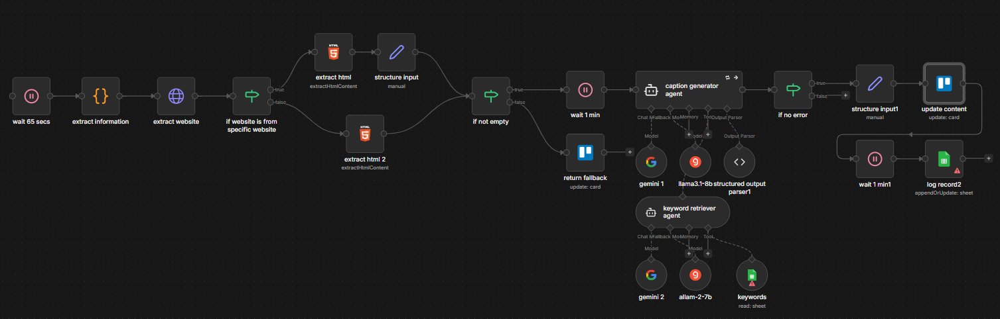

# Automated Facebook Caption Generator

## Project Overview

This project implements an automated content generation pipeline designed to transform raw data into engaging, platform-optimized social media posts. Leveraging a multi-agent architecture, the workflow analyzes user demographics and location data to craft emotionally resonant captions and strategic hashtags. The goal is to scale content production for high-intent dating or matchmaking platforms, ensuring authentic engagement while minimizing manual effort.

## Workflow Logic

The workflow follows a linear, intelligent processing pipeline:

**1. Data Intake & Throttling**

- The process initiates with a trigger, followed by a Wait node (65 secs) to manage rate limiting and ensure stable data ingestion.

**2. Data Extraction**

- An extraction phase pulls raw HTML or structured data from the source, structuring the input for processing.

**3. Intelligent Routing (The "Brain")**

- A conditional node checks for essential data (e.g., "if not empty") to prevent processing errors on incomplete records.
- The system determines if the profile originates from a specific target website or region, allowing for localized content strategies.

**4. AI Content Generation**

- A specialized agent retrieves high-value keywords to ground the content in current trends.
- A primary AI Agent (leveraging models like Gemini or Llama 3.1 7b) synthesizes the profile data, keywords, and regional context to generate a human-like caption and CTA.

**5. Output & Logging**

- The final structured content is updated to the content database, and a log record is created for tracking and auditing.

## Technical Node Stack

- **Wait Node**: Rate limiting/throttling.
- **If/Else Nodes**: Conditional logic branching.
- **HTML Extract/Structure Input**: Data parsing and normalization.
- **Item Summaries**: Intermediate data aggregation.
- **Agents**: Caption Generator Agent, Keyword Retriever Agent.
- **Models**: Google Gemini, Llama 3.1 - 7b (used for cost-effective, high-speed inference).
- **Tools**: Extract Information, Log Record.
- **Update/set node**: Writing to a database or CMS.
- **Google sheet**: Audit trail creation.

## Business Impact

- **Hyper-Localization**: By integrating regional identifiers and specific website checks, the system delivers culturally relevant content that increases user engagement and trust.
- **Operational Efficiency**: The automation replaces manual copywriting, reducing the turnaround time for profile optimization from hours to seconds.
- **Scalability**: The dual-model architecture (using Gemini and Llama 3.1) allows for balancing cost and performance, enabling the processing of thousands of profiles without linear cost increases and as a fallback handling.
- **Quality Assurance**: Built-in validation nodes ensure that only complete, high-quality data is processed, maintaining a professional standard for public-facing content.
