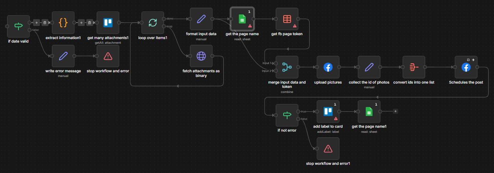

# Automated Facebook Post Scheduler

## Project Overview

This project is a robust automation pipeline designed to manage the lifecycle of social media content, specifically focusing on Facebook page management. It bridges the gap between content repositories and public engagement by automating the validation, media processing, and scheduling of posts. The workflow ensures that only valid, high-quality content goes live, protecting brand integrity while eliminating the need for manual posting.

## The Workflow Logic

**1. Input Validation & Data Integrity**

- This initial phase acts as a gatekeeper, ensuring that only actionable data proceeds through the pipeline.
- The workflow checks if the scheduling parameters are correct using the if date valid node. This prevents backdating errors or scheduling posts for invalid timestamps.
- The system verifies the presence of essential data fields (such as caption text or user IDs). If the data is incomplete, the workflow diverts immediately to an error handling sequence, stopping the process before it consumes API resources.

**2. Data Extraction & Media Aggregation**

- Once validated, the workflow gathers all necessary components for the final post.
- The Extract Information node parses the incoming data stream to isolate the core content (e.g., the post caption, target page details).
- The Get Many Attachments node retrieves associated media files (images or videos) linked to the content record. This step ensures that visual assets are correctly paired with the text before upload.

**3. Platform Authentication & Formatting**

- This phase prepares the technical payload required by the Facebook API.
- Nodes like Get the Page Name and Get FB Page Token securely retrieve the necessary authentication tokens and identifiers. This automated credential handling ensures secure, authorized access without manual login steps.
- The Format Input Data node structures the extracted text, media, and authentication tokens into the specific JSON format required by the Facebook Graph API.

**4. Execution & Error Handling**

- The final phase handles the interaction with the social platform and manages system stability.
- The Upload Pictures node handles the binary file transfer to Facebook's servers, ensuring media is hosted correctly before the post goes live.
- The Schedules the Post node sends the final API request to queue the content for the specified publication time.
- If any step in the process fails (e.g., API timeout, invalid token), the workflow triggers a Stop Workflow and Error node. This captures the error state via Write error message and safely terminates the process, alerting administrators to the issue.

## Technical Node Stack

- **If Date Valid**: Validates the timestamp or scheduling parameters to ensure the post is queued for a valid future time.
- **Extract Information**: Parses the incoming data structure to isolate necessary fields such as the post body, target ID, and metadata.
- **Get Many Attachments**: Retrieves binary media files (images/videos) associated with the content record for upload.
- **Get the Page Name**: Fetches the specific identifier or display name of the target Facebook page for dynamic content insertion.
- **Get FB Page Token**: Securely retrieves the required OAuth access token to authenticate API requests on behalf of the page admin.
- **Format Input Data**: Structures the processed text, media objects, and credentials into the specific JSON payload required by the Facebook API.
- **Upload Pictures**: Handles the multipart/form-data upload of binary image files to the social platform's content delivery network.
- **Schedules the Post**: Sends the final API call to set the publication time and queue the content for display.
- **Stop Workflow and Error**: Terminates the automation sequence immediately upon critical failure to prevent data corruption or invalid posts.
- **Google Sheet**: Logs the workflow status and the content generated for auditing and reviewing.

## Business Impact

**Zero-Error Publishing**: By validating dates and data integrity before processing, the system eliminates common scheduling errors (such as empty posts or broken images), maintaining a professional brand image.
**Operational Efficiency**: The automation handles the complex authentication and media upload process instantly, freeing marketing teams from the repetitive task of manual posting.
**Enhanced Security**: Automated token management (Get FB Page Token) reduces the risk of credential exposure compared to manual handling, ensuring secure access to corporate social media assets.
**Reliability**: The robust error handling ensures that any technical glitches are logged and contained without creating "ghost posts" or corrupting the content queue.
