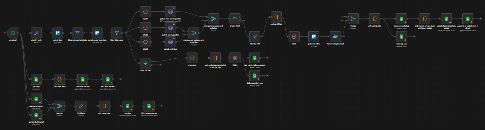

# Trello SEO Project Tracker

## Project Overview

This comprehensive n8n workflow automates the tracking, logging, and performance analysis of a video production pipeline managed via Trello. It functions as an ETL (Extract, Transform, Load) system that synchronizes Trello card activities with Google Sheets, calculating critical KPIs like editing time, QC duration, and revision counts. The workflow operates on a scheduled basis to provide real-time insights into team productivity and content status.

## The Workflow Logic

The workflow is divided into four parallel processing streams that execute concurrently upon the scheduled trigger.

**1. Activity Extraction & State Synchronization**

- This stream focuses on gathering raw data from Trello and updating the central task repository.
- The workflow retrieves all lists from the Trello board and applies a filter (`filter unimportant lists`) to ignore administrative or irrelevant columns.
- For valid lists, it fetches all cards and filters out placeholder cards (e.g., those named ".").
- A parallel execution path uses HTTP Request nodes to fetch three types of Trello activities: General Actions, Card Updates (moves/edits), and New Card Events.
- These activity streams are merged with the card data. A dedicated code block (`extracting data`) processes the history to calculate time diffs (Edit Time, QC Time, Upload Time) and counts revisions.
- The `only return unique task and latest status` node ensures that only the most recent state of each card is retained, updating the master Google Sheets repository.

**2. Daily Snapshot & Shift Management**

- The workflow determines the current shift (AM/PM) based on the execution time.
- Card data is enriched with member details (matching IDs to roles like SEO/VidEd) and list names.
- The `sort and create snapshot id for the day` node generates a unique ID for the batch. It separates tasks into AM and PM arrays, parses markdown descriptions to extract video metadata (Title, YT Links, Category), and saves a "Daily Snapshot" to Google Sheets.

**3. Performance Analytics (Time Tracking)**

- This stream calculates granular performance metrics for the team.
- Fetches historical logs from Google Sheets.
- The `calculate time` node processes logs to determine durations between specific status transitions (e.g., "Editing Start" to "Ready for QC"). It calculates:
  - Total Edit Time
  - Total QC Time
  - Head's QC Time
  - Idle Upload Time
- These metrics are appended to "Raw Time Tracker" and summarized in "SEO Time Tracker" sheets for performance review.

**4. Weekly Aggregation & Reporting**

- This stream compiles completed tasks into weekly performance summaries.
- Retrieves card history and merges it with current task data.
- Uses a robust parser to handle various date formats and calculates the specific week range (Sunday–Saturday) for each task.
- The `calculate data` node groups tasks by Week, Editor, and Shift. It counts completed videos by type (Standard vs. Kirk QC) and aggregates totals.
- Finalized data is pushed to "Raw Data" and "SEO Data Summary" sheets.

## Technical Node Stack

- **Schedule Trigger**: Initiates the workflow via cron expression (e.g., 57 14,23 \* \* 1-6).
- **Trello Nodes**:
  - `get all lists`: Retrieves board structure.
  - `get all cards from lists`: Fetches card details (ID, name, desc, labels).
  - `get card info1`: Retrieves specific card metadata for updates.
- **HTTP Request Nodes**: Direct API calls to Trello to fetch granular activity logs (`actions`) filtered by `updateCard`, `moveCardToBoard`, etc.
- **Filter Nodes**:
  - `filter unimportant lists`: Regex/ID based list exclusion.
  - `filter title cards`: Removes placeholder items.
  - `check if AM/PM`: Routes logic based on execution time.
- **Code Nodes (JavaScript)**:
  - `extracting data`: Parses activity logs, matches valid move rules, and formats timestamps.
  - `calculate time`: Computes time deltas between workflow stages.
  - `sort and create snapshot id`: Markdown parsing and snapshot generation.
  - `only return unique task and latest status`: Deduplication and status validation.
  - `calculate data`: Week range calculation and editor performance aggregation.
- **Merge Nodes**: Combines data streams from card details, activity logs, and historical sheets.
- **Google Sheets Nodes**: Appends or updates data in multiple tabs (Raw Data, Time Tracker, Daily Snapshot, Summary).
- **Wait Nodes**: Strategic pauses to ensure Trello API rate limits are respected during parallel fetching.

## Business Impact

- **Automated Performance Tracking**: Eliminates the need for manual timesheet entry by automatically calculating the time spent in each production stage (Editing, QC, Upload).
- **Real-Time Status Visibility**: Provides a continuously updated "Single Source of Truth" in Google Sheets, allowing managers to see exactly which videos are in progress, pending, or completed.
- **Quality Control Assurance**: Specifically tracks "Kirk's QC" as a distinct metric, ensuring that quality checks are quantified and accounted for in production timelines.
- **Resource Allocation**: By aggregating data by Editor and Shift, the system identifies bottlenecks and high-performing team members, facilitating better resource planning.
- **Historical Auditing**: The daily snapshots and raw logs provide a permanent audit trail of every action taken on a video card, essential for resolving disputes or analyzing past projects.
