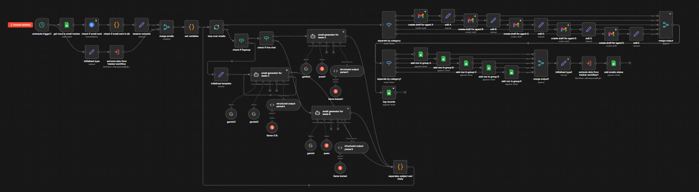

# Welcome Email Fresh Lead Automation

## Project Overview:

This n8n workflow is a sophisticated Automated Lead Engagement System designed to bridge the gap between initial contact (Live Chat) and long-term sales follow-up. It uses AI orchestration to personalize welcome emails at scale, ensuring every lead feels heard without requiring manual writing from agents.

## Workflow Logic Breakdown

The workflow follows a linear logic that branches into complex parallel processing:

**1. Data Retrieval & Deduplication**

- The workflow starts with a Schedule Trigger, likely running at set intervals (e.g., every 15 minutes).
- It pulls new rows from a lead tracker (Google Sheets) and immediately queries a database to check if an email has already been sent. This prevents spamming the client with duplicate welcome messages.
- It cleans and renames columns to ensure the AI has consistent data (Name, Region, Remarks) before merging everything into a unified stream.

**2. AI Generation & Routing**

- The "Loop over emails" node initiates a sequence where the system checks if the lead is part of a specific group (is_group) or originated from a Live Chat.
- This is the "brain" of the operation. The workflow uses several AI models (Gemini, Qwen, and Llama) via specialized "Email Generator" nodes.
- Why Multiple Models? This provides a critical fallback mechanism, ensuring that if one model fails, a secondary one maintains the workflow's uptime. This multi-model approach, paired with structured output parsers, ensures the generated subject, body, and footnote strictly follow your required JSON format every time.
- A code node ("separates subject and body") strips the AI's technical response into clean HTML ready for an email client.

**3. Distribution & Logging**

- Categorization: The workflow identifies which agent (Agent A through E) owns the lead.Draft Creation: Instead of sending automatically and risking an AI "hallucination," it creates a Gmail Draft for the specific agent. This allows for a final human "sanity check" before the "Send" button is hit.
- Feedback Loop: Simultaneously, it logs the action back into the tracker and updates the email status, closing the loop so the lead is no longer marked as "new."

## Technical Node Stack

- **Schedule Trigger and BigQuery Node**:The process begins with a Schedule Trigger that initiates a Google Sheets node to fetch new lead rows. It immediately uses a MySQL/PostgreSQL "execute query" node to cross-reference a database, ensuring no duplicate emails are sent to the same lead.
- **Set Node**: An Edit/Set Variables node standardizes the incoming data—such as first_name, agent_name, and remarks—into a consistent format for the AI models.
- **If Node**: A series of IF Nodes ("check if is_group", "check if live chat") routes the data to the appropriate generation path based on the lead's origin.
- **AI Agents**: This is a multi-model "fallback" setup using Gemini, Qwen, and Llama nodes. Each model is paired with a Structured Output Parser to ensure the generated content (Subject, Body, Footnote) strictly adheres to a JSON schema.
- **Code Node**: A Code Node ("separates subject and body") parses the AI's JSON response, cleaning the HTML and preparing it for the final delivery stage.
- **Gmail and Google Sheet Node**: The workflow concludes with Gmail nodes that create drafts for specific agents (Agents A through E) and Google Sheets nodes that update the lead's status to "sent" or "logged".

## Business Impact

**Speed to Lead**: Reduces the time between a Live Chat exit and a personalized follow-up from hours to minutes.
**Scalability**: Allows a small team of 5 agents (A-E) to handle hundreds of new leads daily without writing a single manual "Hello."
**Personalization**: By analyzing the remarks field, the AI addresses specific client questions, which significantly increases open and reply rates compared to generic templates.
**Operational Security**: The deduplication and "Draft" stages ensure the company doesn't look unprofessional due to double-emails or AI errors.
